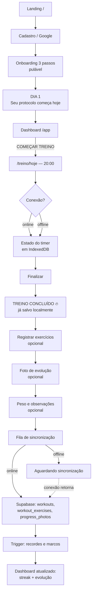
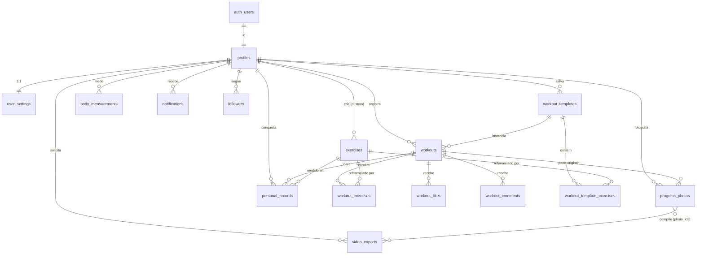

# PROTOCOLO40 — Documento de Arquitetura (Entrega 1)

> **20 minutos. Todos os dias.**
> Arquitetura aprovada em 22/08/2026. **Fases 0 e 1 concluídas** — a Fase 2 é a próxima.
> Versão 1.2 — 22/08/2026 · repositório: `devjoaovictor1984/protocolo40`

---

## 1. ARQUITETURA

### 1.1 Forma geral

Monólito modular Next.js (App Router) + Supabase, com **quatro camadas de responsabilidade** e uma regra de dependência única: **as camadas de baixo nunca conhecem as de cima.**

```
app/          rotas, layouts, metadata, Server Actions finas   → conhece features
features/     composição de UI por domínio + hooks de cliente  → conhece services, lib, components
services/     REGRAS DE NEGÓCIO PURAS (sem React, sem Supabase)→ não conhece nada
lib/          infraestrutura (supabase, storage, offline, zod) → não conhece features
```

`services/` é o coração do produto: streak, duração, detecção de recorde, agregação de volume, elegibilidade de marco. **Funções puras: entram dados, saem dados.** É o que garante o §73 (testes) sem mock de banco e o §85 ("não misturar lógica de negócio com UI").

### 1.2 Estrutura de pastas

```
protocolo40/
├─ app/
│  ├─ (marketing)/              # público, estático, SEO
│  │  ├─ page.tsx               # landing /
│  │  └─ u/[username]/page.tsx  # perfil público
│  ├─ (auth)/                   # login, cadastro, esqueci-senha
│  ├─ (app)/                    # privado: middleware + guard no layout
│  │  ├─ layout.tsx             # shell: bottom nav (mobile) / sidebar (desktop)
│  │  ├─ app/                   # dashboard
│  │  ├─ treino/ treinos/ historico/ calendario/
│  │  └─ evolucao/ medidas/ recordes/ comunidade/ perfil/ configuracoes/
│  ├─ api/
│  │  ├─ sync/route.ts          # flush da fila offline (idempotente)
│  │  ├─ photos/sign/route.ts   # signed URLs temporárias
│  │  └─ video/jobs/route.ts    # enfileirar export
│  ├─ manifest.ts  sitemap.ts  robots.ts  opengraph-image.tsx
│  └─ sw.ts                     # Serwist
├─ components/ui/               # shadcn/ui (primitivos, sem regra de negócio)
├─ components/                  # design system do produto (Timer, StreakBadge…)
├─ features/
│  ├─ auth/ onboarding/ dashboard/ workouts/ exercises/ timer/
│  ├─ calendar/ progress/ photos/ measurements/ records/ community/ settings/
│  └─ <cada um>: components/ · hooks/ · actions.ts · queries.ts · schema.ts
├─ lib/
│  ├─ supabase/    client.ts server.ts admin.ts middleware.ts types.ts
│  ├─ auth/        session.ts guards.ts
│  ├─ storage/     upload.ts image-pipeline.ts signed-url.ts
│  ├─ offline/     db.ts queue.ts sync.ts network.ts
│  ├─ validation/  schemas compartilhados (Zod)
│  ├─ permissions/ visibility.ts (espelha a RLS, não a substitui)
│  └─ analytics/   events.ts
├─ services/       streak.ts duration.ts records.ts volume.ts milestones.ts suggestions.ts
├─ hooks/  types/  tests/
├─ supabase/
│  ├─ migrations/  0001_init.sql … (versionadas, §74)
│  ├─ seed/        exercises.sql, system_templates.sql (§75)
│  └─ functions/   edge functions
└─ worker/         serviço Node + FFmpeg (Fase 3, deploy separado)
```

### 1.3 Decisões e o porquê

| # | Decisão | Por quê |
|---|---|---|
| D1 | **RSC por padrão; `"use client"` só em ilhas** | Timer, câmera, gráficos e fila offline são ilhas pequenas. Dashboard, histórico, calendário e perfil público renderizam no servidor → menos JS, melhor LCP em 3G (§54). |
| D2 | **Três clientes Supabase distintos** | `client.ts` (anon, browser, RLS), `server.ts` (cookies, RSC/Actions), `admin.ts` (service role, **só** no worker e em módulos `server-only`). Import indevido é bloqueado por `import 'server-only'` + regra de lint (§85). |
| D3 | **Escrita: Server Actions — exceto o que precisa funcionar offline** | Treino, medida e foto usam **local-first**: gravam no IndexedDB e sobem pelo `supabase-js` do browser (a RLS autoriza). Server Action não existe offline; forçá-la quebraria o §14, que é crítico. |
| D4 | **Leitura: RSC para páginas, TanStack Query para estado vivo** | Regra fixa: dado de página = RSC + `revalidateTag`; dado que muda por interação/sync (streak, fila, status) = TanStack Query com persister no IndexedDB. Evita a aplicação inteira virar Client Component (§1). |
| D5 | **Idempotência por `client_id`** | Todo registro criado offline nasce com um UUID v4 gerado no cliente. `unique (user_id, client_id)` + upsert → reenviar a fila nunca duplica treino (§53). |
| D6 | **O dia do treino é uma coluna `date` no fuso do usuário** | Streak calculado em `timestamptz` puro quebra para quem treina 23h50 ou viaja. `workouts.workout_date` é derivado de `profiles.timezone`; streak e calendário só olham essa coluna (§23). |
| D7 | **Cronômetro baseado em timestamp, não em contador** | Fonte da verdade: `started_at` + registro de pausas, persistido no IndexedDB a cada tick. Render por `requestAnimationFrame`; `visibilitychange` recalcula pelo relógio. Sobrevive a background, tela bloqueada e encerramento do PWA (§13). |
| D8 | **Regra de negócio pura em `services/`** | `calculateStreak(days, today, tz)` recebe um array de datas e devolve `{current, longest, total}`. Testável sem banco e reutilizável no servidor, no cliente e no worker (§73). |
| D9 | **Sugestões de treino = templates de sistema (`owner_id IS NULL`)** | Evita uma tabela nova e permite "USAR HOJE" com o mesmo código do template do usuário (§19/§20). Filtros por `tags[]` + `level` com índice GIN. |
| D10 | **Vídeo assíncrono: fila em Postgres + worker externo** | FFmpeg nunca em request da Vercel (§35/§85). `video_exports` é a fila; a interface `VideoExportQueue` tem driver trocável — hoje `postgres-poll`, depois SQS/QStash sem mudar a aplicação. |
| D11 | **Fotos: bucket privado + signed URL curta (5 min), sempre** | Nenhuma URL pública permanente para foto de corpo (§27). A assinatura só acontece no servidor, após checagem de visibilidade que **espelha** a RLS — nunca a substitui (§41). |
| D12 | **Pipeline de imagem no cliente** | `createImageBitmap` + OffscreenCanvas: corrige orientação EXIF, redimensiona (máx 1440px), gera thumb de 320px, exporta WebP q80. Sobe ~150 KB em vez de 6 MB (§28). |
| D13 | **Treino e foto são transações independentes** | O treino confirma primeiro; a foto entra na fila. Falha de upload nunca derruba o treino (§29). |
| D14 | **Zod compartilhado entre cliente e servidor** | Um schema por entidade em `lib/validation`, consumido pelo React Hook Form e revalidado na Action/API (§76). |

### 1.4 O que fica de fora do MVP, de propósito

Comunidade (Fase 4), vídeo (Fase 3), Web Push, i18n multi-idioma e exportação de dados. Todos previstos no schema; nenhum ocupando espaço na interface antes do núcleo funcionar (§3).

---

## 2. SITEMAP

### Públicas

| Rota | Render | Observação |
|---|---|---|
| `/` | Static | Landing (§63–65), OG, Twitter Cards, JSON-LD. |
| `/login` | Ilha client | E-mail+senha e Google. |
| `/cadastro` | Ilha client | |
| `/esqueci-senha` · `/redefinir-senha` | Ilha client | |
| `/u/[username]` | Dynamic RSC | Perfil público; `noindex` quando `profile_visibility != public` (§66). |
| `/manifest.webmanifest` · `/sitemap.xml` · `/robots.txt` | Static | |

### Privadas (middleware de sessão + `requireUser()` no layout)

| Rota | Render | Função |
|---|---|---|
| `/onboarding` | Client (stepper) | 3 passos, pulável (§10). |
| `/app` | RSC + ilhas | Dashboard (§12). |
| `/treino/hoje` | Client | Cronômetro (§13). |
| `/treino/novo` | Client | Registro manual de treino já realizado. |
| `/treino/[id]` | RSC | Detalhe do treino. |
| `/treino/[id]/editar` | Client | |
| `/treino/[id]/finalizar` | Client | Pós-treino: exercícios, observações, foto, peso (§15). |
| `/treinos` | RSC + filtros | Sugestões e templates (§20). |
| `/treinos/favoritos` | RSC | |
| `/treinos/[id]` | RSC | Template + `USAR HOJE`. |
| `/historico` | RSC + busca | §21. |
| `/calendario` | RSC + ilha | §22. |
| `/evolucao` | RSC + gráficos | §30/§31. |
| `/evolucao/fotos` | RSC | Grade por data. |
| `/evolucao/comparar` | Client | Slider antes/depois (§32). |
| `/evolucao/video` | Client | Fase 3 (§34). |
| `/medidas` | RSC + form | §25. |
| `/recordes` | RSC | §24. |
| `/comunidade` · `/comunidade/feed` | RSC | Fase 4. |
| `/perfil` | RSC | §38. |
| `/configuracoes` · `/configuracoes/privacidade` · `/configuracoes/conta` | RSC + forms | §40 / §78. |
| `/offline` | Static | Fallback do service worker. |

**Navegação mobile (§7):** `Hoje · Histórico · [+] · Evolução · Perfil`.
O `+` abre um bottom sheet: *Começar treino agora* · *Registrar treino passado* · *Registrar peso* · *Foto de hoje*.
**Desktop (§8):** sidebar discreta, sem breadcrumbs no primeiro nível — só em `/treino/[id]/editar` e `/evolucao/*`.

---

## 3. FLUXO PRINCIPAL



**Invariante do fluxo:** entre `I` e `J` não existe rede. O treino está salvo antes de qualquer requisição. Tudo depois de `J` é opcional e pode falhar sem perder nada.

---

## 4. BANCO DE DADOS

PostgreSQL 15 (Supabase). UUID v4 em todas as PKs. `created_at` / `updated_at timestamptz` com trigger `set_updated_at()`. `deleted_at` onde há recuperação ou integridade referencial (§48).

### Tipos

```sql
create type visibility     as enum ('private','followers','public');
create type workout_level  as enum ('iniciante','intermediario','avancado');
create type workout_place  as enum ('casa','academia','externa','misto');
create type exercise_cat   as enum ('peito','costas','ombros','bracos','pernas',
                                    'abdomen','cardio','mobilidade','corpo_inteiro');
create type exercise_mode  as enum ('reps','time','distance','load');
create type record_metric  as enum ('reps','duration','distance','weight','rounds','volume');
create type export_status  as enum ('queued','processing','completed','failed','canceled');
create type follow_status  as enum ('pending','accepted');
```

### profiles

| Coluna | Tipo | Regra |
|---|---|---|
| `id` | uuid PK | → `auth.users(id)` ON DELETE CASCADE |
| `username` | citext UNIQUE NOT NULL | `~ '^[a-z0-9_]{3,20}$'` |
| `full_name` | text | ≤ 80 |
| `avatar_path` | text | caminho no bucket `avatars` |
| `bio` | text | ≤ 280 |
| `birth_date` | date | **sem restrição de idade** (§4) |
| `height_cm` | smallint | 80–260 |
| `goal` | text | 8 valores do §10 |
| `level` | workout_level | default `iniciante` |
| `default_location` | workout_place | default `casa` |
| `timezone` | text NOT NULL | default `America/Sao_Paulo` — base do streak (D6) |
| `locale` | text | default `pt-BR` |
| `protocol_started_on` | date NOT NULL | default `current_date` |
| `onboarding_completed_at` | timestamptz | NULL = perfil incompleto, mas app liberado |
| `created_at` / `updated_at` / `deleted_at` | timestamptz | |

Índices: `unique(lower(username))` · `idx_profiles_username`.

### user_settings

`user_id uuid PK → profiles` · `theme text default 'system'` · `daily_goal_seconds int default 1200` ·
`profile_visibility` / `workouts_visibility` / `photos_visibility` / `weight_visibility` / `measurements_visibility` / `streak_visibility` — todos `visibility default 'private'` (§40) ·
`allow_followers bool default true` · `reminder_time time` · `notification_prefs jsonb default '{}'` · timestamps.

### exercises

`id uuid PK` · `owner_id uuid → profiles ON DELETE CASCADE` (NULL = exercício de sistema) · `slug citext` · `name text NOT NULL` · `category exercise_cat NOT NULL` · `modality exercise_mode NOT NULL` · `equipment text[] default '{}'` · `instructions text` · `is_active bool default true` · timestamps · `deleted_at`.

Índices: `unique(slug) where owner_id is null` · `unique(owner_id, lower(name)) where deleted_at is null` · `idx_exercises_category (category) where deleted_at is null` · `gin(equipment)`.

### workouts

| Coluna | Tipo | Regra |
|---|---|---|
| `id` | uuid PK | |
| `user_id` | uuid NOT NULL | → profiles ON DELETE CASCADE |
| `client_id` | uuid NOT NULL | **UNIQUE(user_id, client_id)** — idempotência (D5) |
| `template_id` | uuid | → workout_templates ON DELETE SET NULL |
| `title` / `description` | text | ≤ 80 / ≤ 1000 |
| `started_at` | timestamptz NOT NULL | |
| `finished_at` | timestamptz | `>= started_at` |
| `duration_seconds` | int NOT NULL | `> 0 and <= 86400` — **sem piso de 20 minutos** (§5) |
| `workout_date` | date NOT NULL | dia local do usuário (D6) |
| `rounds` | smallint | ≥ 0 |
| `effort` | smallint | 1–10 (percepção de esforço) |
| `location` | workout_place | |
| `visibility` | visibility NOT NULL | default `private` |
| `notes` | text | ≤ 1000 |
| `created_at` / `updated_at` / `deleted_at` | timestamptz | |

Índices: `idx_workouts_user_date (user_id, workout_date desc) where deleted_at is null` · `idx_workouts_user_started (user_id, started_at desc)` · `idx_workouts_feed (created_at desc) where visibility='public' and deleted_at is null` · `idx_workouts_template (template_id)`.

### workout_exercises

`id uuid PK` · `workout_id → workouts ON DELETE CASCADE` · `exercise_id → exercises ON DELETE RESTRICT` · `sets smallint` · `repetitions int` · `duration_seconds int` · `distance_meters int` · `weight_kg numeric(6,2)` · `order_index smallint NOT NULL` · `notes text`.

Constraint: ao menos uma métrica preenchida.
Índices: `unique(workout_id, order_index) deferrable` · `idx_we_workout (workout_id)` · `idx_we_exercise (exercise_id, workout_id)` ← consultas de volume e recorde (evita N+1 e full scan, §54).

### workout_templates · workout_template_exercises

`workout_templates`: `id` · `owner_id → profiles` (NULL = sistema, D9) · `title` · `description` · `level workout_level` · `place workout_place` · `tags text[]` · `estimated_seconds int default 1200` · `is_favorite bool default false` · `use_count int default 0` · `is_active bool` · timestamps · `deleted_at`.

`workout_template_exercises`: `id` · `template_id ON DELETE CASCADE` · `exercise_id ON DELETE RESTRICT` · `sets` · `repetitions` · `duration_seconds` · `distance_meters` · `weight_kg` · `order_index` · `notes`.

Índices: `idx_templates_owner (owner_id) where deleted_at is null` · `gin(tags)` · `idx_templates_level (level) where owner_id is null`.

### body_measurements

`id` · `user_id` · `client_id uuid NOT NULL` · `measured_on date NOT NULL` · `weight_kg numeric(5,2)` (20–400) · `waist_cm` / `chest_cm` / `arm_cm` / `hip_cm` / `thigh_cm numeric(5,2)` · `body_fat_pct numeric(4,1)` (1–70) · `notes` · timestamps · `deleted_at`.
Todos opcionais exceto a data (§25).

Índices: `unique(user_id, measured_on) where deleted_at is null` (upsert do dia) · `unique(user_id, client_id)` · `idx_bm_user_date (user_id, measured_on desc)`.

### progress_photos

`id` · `user_id` · `client_id uuid NOT NULL` · `workout_id → workouts ON DELETE SET NULL` · `storage_path text NOT NULL` · `thumbnail_path text NOT NULL` · `pose text check in ('frente','lado','costas','outro')` · `taken_at timestamptz NOT NULL` · `taken_on date NOT NULL` · `weight_kg numeric(5,2)` · `width` / `height int` · `byte_size int` · `visibility visibility NOT NULL default 'private'` (§27) · `notes` · `created_at` · `deleted_at`.

Índices: `idx_photos_user_taken (user_id, taken_at desc) where deleted_at is null` · `unique(user_id, client_id)` · `idx_photos_workout (workout_id)`.

### personal_records

`id` · `user_id` · `exercise_id → exercises` (NULL para métricas do treino, como rounds e duração) · `metric record_metric NOT NULL` · `value numeric(10,2) NOT NULL` · `unit text` · `workout_id → workouts ON DELETE CASCADE` · `achieved_on date NOT NULL` · `previous_value numeric(10,2)` · `created_at`.

A tabela guarda o **histórico completo** (§24); o recorde atual é `max(value)` por `(user_id, exercise_id, metric)`.
Índices: `idx_pr_lookup (user_id, exercise_id, metric, value desc)` · `idx_pr_user_date (user_id, achieved_on desc)`.

### followers · workout_likes · workout_comments

- `followers`: PK `(follower_id, following_id)` · `status follow_status default 'accepted'` · `created_at` · `check (follower_id <> following_id)` · índice `(following_id, status)`.
- `workout_likes`: PK `(workout_id, user_id)` · `created_at` · índice `(user_id)`.
- `workout_comments`: `id` · `workout_id ON DELETE CASCADE` · `user_id` · `body text` (1–500, sanitizado, §76) · timestamps · `deleted_at` · índice `(workout_id, created_at) where deleted_at is null`.

### notifications

`id` · `user_id` · `type text` · `actor_id → profiles ON DELETE SET NULL` · `entity_type text` · `entity_id uuid` · `payload jsonb` · `read_at timestamptz` · `created_at`.
Índice: `idx_notif_unread (user_id, created_at desc) where read_at is null`.

### video_exports

`id` · `user_id` · `status export_status default 'queued'` · `start_date date` · `end_date date` · `photo_ids uuid[]` · `format text check in ('9:16','1:1','16:9')` · `frame_duration_ms int check in (200,500,1000,2000)` · `options jsonb` (overlays: dia, data, peso, marca) · `output_path text` · `thumbnail_path text` · `progress smallint default 0` · `attempts smallint default 0` · `error text` · `created_at` · `started_at` · `completed_at`.
Índice do worker: `idx_exports_queue (created_at) where status = 'queued'`.

### analytics_events (§71)

`id` · `user_id` · `name text` · `props jsonb` · `occurred_at timestamptz default now()`.
Nunca recebe peso, medida, foto ou texto livre — só os eventos nomeados no §71.

### Cálculo de streak (§23)

Sem tabela denormalizada no MVP. Função `stable`, `SECURITY INVOKER` (a RLS continua valendo), com *gaps and islands* sobre `distinct workout_date`:

```sql
create or replace function public.get_user_stats(p_user uuid)
returns table (current_streak int, longest_streak int, total_days int, total_seconds bigint)
language sql stable as $$
  with tz as (select coalesce(timezone,'America/Sao_Paulo') t from profiles where id = p_user),
  today as (select (now() at time zone (select t from tz))::date d),
  days as (
    select distinct workout_date as day
    from workouts where user_id = p_user and deleted_at is null
  ),
  grouped as (
    select day, day - (row_number() over (order by day))::int as grp from days
  ),
  runs as (
    select min(day) ini, max(day) fim, count(*)::int len from grouped group by grp
  )
  select
    coalesce((select len from runs
              where fim >= (select d from today) - 1
              order by fim desc limit 1), 0),
    coalesce((select max(len) from runs), 0),
    (select count(*)::int from days),
    (select coalesce(sum(duration_seconds),0) from workouts
      where user_id = p_user and deleted_at is null);
$$;
```

O `fim >= hoje - 1` é o que mantém a sequência viva durante o dia corrente sem exigir que o treino de hoje já exista.

---

## 5. ERD



**Cardinalidades que importam:** um treino → N exercícios; um exercício de sistema é referenciado por milhares de treinos (daí `ON DELETE RESTRICT` + soft delete); uma foto pode existir sem treino (foto avulsa) e um treino pode ter várias fotos.

---

## 6. RLS

RLS **habilitada em todas as tabelas** (§41). Nenhuma tabela recebe `USING (true)` para escrita.

### Helpers (`SECURITY DEFINER`, `stable`, `search_path = public`)

```sql
create function public.is_follower(p_owner uuid, p_viewer uuid) returns boolean
language sql stable security definer set search_path = public as $$
  select exists (
    select 1 from followers
    where following_id = p_owner and follower_id = p_viewer and status = 'accepted'
  );
$$;

create function public.can_view(p_owner uuid, p_visibility visibility) returns boolean
language sql stable security definer set search_path = public as $$
  select case
    when p_owner = auth.uid()        then true
    when p_visibility = 'public'     then true
    when p_visibility = 'followers'  then public.is_follower(p_owner, auth.uid())
    else false
  end;
$$;
```

`SECURITY DEFINER` aqui evita **recursão de política**: sem isso, a policy de `workouts` consultaria `followers`, cuja policy consultaria `profiles`, e assim por diante — problema clássico de RLS no Supabase.

### Matriz de políticas

| Tabela | SELECT | INSERT | UPDATE | DELETE |
|---|---|---|---|---|
| `profiles` | próprio **ou** `can_view(id, profile_visibility)` | `id = auth.uid()` | próprio | ❌ (cascade do auth) |
| `user_settings` | próprio | próprio | próprio | ❌ |
| `exercises` | `owner_id is null` **ou** próprio | próprio | próprio | próprio (soft) |
| `workouts` | próprio **ou** `can_view(user_id, visibility)` | próprio | próprio | próprio |
| `workout_exercises` | via `exists(...)` sobre o treino pai | dono do treino | dono | dono |
| `workout_templates` | `owner_id is null` **ou** próprio | próprio | próprio | próprio |
| `body_measurements` | próprio **ou** `can_view(user_id, measurements_visibility)` | próprio | próprio | próprio |
| `progress_photos` | próprio **ou** `can_view(user_id, visibility)` | próprio **e** `visibility = 'private'` | próprio | próprio |
| `personal_records` | próprio | ❌ direto — só via trigger | ❌ | próprio |
| `followers` | envolvido na relação | `follower_id = auth.uid()` e alvo com `allow_followers` | o alvo (aceitar) | qualquer um dos dois |
| `workout_likes` | quem enxerga o treino | próprio + treino visível | ❌ | próprio |
| `workout_comments` | quem enxerga o treino | próprio + treino visível | próprio | próprio **ou** dono do treino |
| `notifications` | próprio | ❌ (trigger) | próprio (só `read_at`) | próprio |
| `video_exports` | próprio | próprio | ❌ (worker via service role) | próprio |
| `analytics_events` | ❌ | próprio | ❌ | ❌ |

Exemplo canônico:

```sql
alter table workouts enable row level security;

create policy workouts_select on workouts for select
  using (deleted_at is null and (user_id = auth.uid() or public.can_view(user_id, visibility)));

create policy workouts_insert on workouts for insert
  with check (user_id = auth.uid());

create policy workouts_update on workouts for update
  using (user_id = auth.uid()) with check (user_id = auth.uid());

create policy workouts_delete on workouts for delete
  using (user_id = auth.uid());
```

**A foto nasce privada no banco, não na aplicação (§27):**

```sql
create policy photos_insert on progress_photos for insert
  with check (user_id = auth.uid() and visibility = 'private');
```

Tornar pública exige um `UPDATE` explícito do dono. Nenhum caminho de código consegue publicar automaticamente.

**Recordes são gravados por trigger**, nunca pelo cliente — assim ninguém forja um recorde chamando a API direto.

---

## 7. STORAGE

| Bucket | Público | Estrutura | Limite |
|---|---|---|---|
| `avatars` | sim | `{user_id}/avatar.webp` | 512 KB · 512×512 |
| `progress-photos` | **não** | `{user_id}/{yyyy}/{MM}/{uuid}.webp` + `{uuid}_thumb.webp` | 2 MB |
| `video-exports` | **não** | `{user_id}/{export_id}.mp4` | 100 MB |

Políticas por prefixo de pasta:

```sql
create policy "own folder read" on storage.objects for select
  using (bucket_id = 'progress-photos'
         and (storage.foldername(name))[1] = auth.uid()::text);
```

Mesma regra para `insert` / `update` / `delete`.

**Leitura por terceiros nunca passa por policy direta**: passa por `/api/photos/sign`, que consulta `progress_photos` (sujeita à RLS) e só então emite `createSignedUrl(path, 300)`. Assim a autorização vive no banco (§41) e a URL expira em 5 minutos.

**Ciclo de vida:** exclusão de conta (§78) apaga o prefixo `{user_id}/` nos três buckets antes de remover o `auth.user`. Vídeos exportados expiram em 30 dias por rotina de limpeza.

---

## 8. OFFLINE

### IndexedDB (base `p40`, via `idb`)

| Store | keyPath | Conteúdo |
|---|---|---|
| `active_session` | `id` | sessão do cronômetro em andamento (uma só) |
| `workouts` | `client_id` | treinos locais + `sync_state`, **com os exercícios embutidos** |
| `measurements` | `client_id` | |
| `photos` | `client_id` | metadados + **Blob** já processado |
| `pending_operations` | auto | a fila (§53) |
| `cache` | `key` | exercícios, templates, últimos 30 dias, stats |

`sync_state ∈ { local, pending, syncing, synced, failed }`.

Os exercícios ficam dentro do registro do treino, e não numa store própria como
previa a v1.0: um treino é criado, editado e sincronizado como uma unidade só, e
separar as duas coisas só criaria a chance de subir metade. Na sincronização, os
exercícios do treino são substituídos por completo — é o que faz o reenvio
convergir para o mesmo estado sem duplicar linha.

### Fila

```ts
type PendingOperation = {
  id: number;
  type: 'CREATE_WORKOUT' | 'UPDATE_WORKOUT' | 'UPLOAD_PHOTO' | 'CREATE_MEASUREMENT';
  client_id: string;      // idempotência (D5)
  depends_on?: string;    // client_id do treino, para fotos
  payload: unknown;
  attempts: number;       // backoff exponencial 2^n, máx. 6
  next_attempt_at: number;
  created_at: number;
};
```

**Ordem:** FIFO respeitando `depends_on` — `CREATE_WORKOUT` sempre antes do `UPLOAD_PHOTO` que o referencia.
**Gatilhos:** evento `online`, foco da janela, Background Sync API (Android) e botão manual no chip de status.
**Falha permanente** (4xx que não seja 401/409): marca `failed` e expõe "Tentar novamente". Nunca descarte silencioso.

**Idempotência:** todo insert usa `upsert(..., { onConflict: 'user_id,client_id', ignoreDuplicates: true })`. Reprocessar a fila inteira duas vezes produz exatamente o mesmo estado (§53).

**Conflito:** o treino é, na prática, *append-only* (um registro, um dono, um dispositivo por vez). Regra: *last-write-wins* por `updated_at`, com uma exceção — `duration_seconds` nunca é sobrescrito por um valor menor vindo de outro dispositivo.

**Status na UI (§14):** chip discreto no topo do dashboard —
`✓ Sincronizado` · `☁ Aguardando sincronização · 2` · `⚠ Falha ao sincronizar — Tentar novamente`.
Sempre com ícone e texto, nunca só por cor (§55).

---

## 9. PWA

**Manifest** (`app/manifest.ts`): `name: "Protocolo40"` · `short_name: "P40"` · `display: standalone` · `orientation: portrait` · `start_url: /app` · `theme_color` · `background_color` · ícones 192/512 + `maskable` · `shortcuts: [{ name: "Começar treino", url: "/treino/hoje" }]`.

**Serwist** (`app/sw.ts` + `serwist.config.mjs`). O service worker é compilado num **passo de build próprio**, `next build && serwist build`, e não como plugin de bundler: a partir do Next 16 o Turbopack é o padrão, e o caminho de plugin do Serwist ainda depende de webpack. O registro no cliente fica com o `SerwistProvider`.

Estratégias por recurso:

| Recurso | Estratégia | Motivo |
|---|---|---|
| App shell, JS/CSS | Precache | abertura instantânea |
| `/app`, `/treino/hoje`, `/treinos` | NetworkFirst (timeout 3 s) → cache | o treino precisa abrir offline (§52) |
| `/historico`, `/calendario`, `/evolucao` | StaleWhileRevalidate | tolera dado de 1 minuto |
| Thumbnails de foto | CacheFirst · 200 itens · 30 dias | §54 |
| Signed URLs, `/api/*`, feed | NetworkOnly | dado sensível ou efêmero não vai para o cache |
| Navegação sem rede | fallback `/offline` | |

**iOS:** sem Background Sync e com Web Push limitado → flush da fila no `visibilitychange`; splash via `apple-touch-startup-image`; `viewport-fit=cover` + `env(safe-area-inset-bottom)` na bottom nav; `-webkit-touch-callout: none` na área do cronômetro.

**Wake Lock** (`navigator.wakeLock`) durante o treino, com degradação silenciosa onde não houver suporte.

---

## 10. DESIGN SYSTEM

### Tokens (CSS custom properties + Tailwind v4)

| Token | Light | Dark |
|---|---|---|
| `--bg` | `oklch(99% 0 0)` | `oklch(15% 0.01 260)` |
| `--surface` | `oklch(97% 0.003 260)` | `oklch(19% 0.012 260)` |
| `--fg` | `oklch(20% 0.02 260)` | `oklch(96% 0.005 260)` |
| `--muted-fg` | `oklch(50% 0.015 260)` | `oklch(65% 0.015 260)` |
| `--primary` | `oklch(58% 0.19 28)` | `oklch(65% 0.19 28)` — laranja-fogo (streak) |
| `--accent` | `oklch(62% 0.14 160)` | `oklch(68% 0.14 160)` — verde (concluído) |
| `--border` | `oklch(92% 0.005 260)` | `oklch(27% 0.012 260)` |

Contraste mínimo 4.5:1 para texto e 3:1 para ícones e anel de foco (§55). Tema `light · dark · system`, persistido em `user_settings.theme` + cookie para evitar flash (§69).

**Tipografia:** Inter variable. Escala `12 · 14 · 16 · 20 · 24 · 32 · 48 · 64`. O cronômetro usa `tabular-nums` em 64–96px para os dígitos não "pularem" a cada segundo.

**Espaçamento:** base 4px — `4 8 12 16 24 32 48 64`. Padding lateral padrão de 16px no mobile.

**Raio:** `sm 8 · md 12 · lg 16 · full`. Cards 16, botões 12.

**Toque (§58):** alvo mínimo 48×48px; ações destrutivas a ≥ 24px das primárias; `COMEÇAR TREINO` ocupa a largura do card com 64px de altura; controles do cronômetro na metade inferior da tela (operação com uma mão).

**Movimento:** 150–250ms, `ease-out`; tudo respeitando `prefers-reduced-motion`.

### Componentes (§57)

`Button` (primary · secondary · ghost · destructive; sm · md · lg) · `IconButton` · `Card` · `StatCard` · `WorkoutCard` · `ExerciseRow` · `Timer` · `ProgressRing` · `StreakBadge` · `CalendarDay` · `PhotoCard` · `ComparisonSlider` · `EmptyState` · `Skeleton` · `BottomSheet` · `Drawer` · `Toast` · `Avatar` · `SyncStatus` · `RecordBadge` · `BottomNav` · `SideNav`.

Regra: componente do design system **não** importa de `features/` nem de `services/`. Recebe props e devolve UI.

### Responsividade (§56)

Projetado em 360 / 390 / 430. `sm 640` → listas em 2 colunas · `md 768` → calendário expandido · `lg 1024` → sidebar substitui a bottom nav, conteúdo com máximo de 1120px. Nunca desktop-first.

---

## 11. WIREFRAMES

### Dashboard `/app`

```
┌─────────────────────────────┐
│ PROTOCOLO40          ✓ sync │
│ Bom dia, João               │
│ 🔥 15 dias seguidos         │
│ ┌─────────────────────────┐ │
│ │        DIA 16           │ │
│ │        20:00            │ │  ← ProgressRing + tempo
│ │   ▸ COMEÇAR TREINO      │ │  ← 64px, largura total
│ └─────────────────────────┘ │
│ AGOSTO                      │
│ S  T  Q  Q  S  S  D         │
│ ●  ●  ●  ●  ●  ●  ●         │  ● treinado
│ ●  ●  ●  ●  ●  ●  ●         │  ○ sem treino
│ ●  ◎                        │  ◎ hoje
│ ÚLTIMO TREINO               │
│ ┌─────────────────────────┐ │
│ │ Tom Holland             │ │
│ │ 10 rounds · 20 minutos  │ │
│ └─────────────────────────┘ │
│ 47 treinos · 940 min · 🔥21 │
├─────────────────────────────┤
│ Hoje  Hist.  ⊕  Evol. Perfil│
└─────────────────────────────┘
```

### Cronômetro `/treino/hoje`

```
┌─────────────────────────────┐
│ ✕                Tom Holland│
│                             │
│         ╭─────────╮         │
│         │  17:42  │         │  ← ProgressRing, dígitos 96px
│         ╰─────────╯         │
│    regressivo ⇄ crescente   │
│                             │
│   ☐ 5 barras                │
│   ☑ 10 flexões              │  ← checklist do template
│   ☐ 15 agachamentos         │
│      Rounds:  −  3  +       │
│                             │
│  ┌────────┐   ┌───────────┐ │
│  │ PAUSAR │   │ FINALIZAR │ │  ← 56px, bem separados
│  └────────┘   └───────────┘ │
│         + 5 minutos         │
│  ☁ Offline — salvo no       │
│     aparelho                │
└─────────────────────────────┘
```

### Pós-treino `/treino/[id]/finalizar`

```
      TREINO CONCLUÍDO 🔥
        20:04 · Dia 16

   🔥 NOVO RECORDE — 10 rounds

  ┌──────────────────────────┐
  │ ＋ Registrar exercícios  │
  │ ＋ Foto de evolução      │
  │ ＋ Peso de hoje          │
  │ ＋ Observações           │
  └──────────────────────────┘

        [ CONCLUIR ]

   Tudo opcional. O treino
   já está salvo.
```

### Comparação `/evolucao/comparar`

```
   DIA 1        ┃        DIA 60
  ┌─────────────┃─────────────┐
  │             ┃             │  ← slider arrastável
  │   foto A    ┃    foto B   │
  └─────────────┃─────────────┘
   01/06        ┃        30/07
   92,0 kg      ┃        86,4 kg

       − 5,6 kg em 60 dias

  [ lado a lado ]  [ sobrepor ]
  [ CRIAR VÍDEO DA EVOLUÇÃO ]
```

### Estado vazio (§62)

```
        ╭───────╮
        │   ⏱   │
        ╰───────╯

    Seu primeiro treino
       começa aqui.

    [ COMEÇAR TREINO ]
```

---

## 12. ROADMAP

### FASE 0 — FUNDAÇÃO ✅ *(concluída em 22/08/2026)*

Next.js 16 + TypeScript strict + Tailwind v4 + shadcn/ui · projeto Supabase e variáveis de ambiente · migrations `0001_types` → `0006_rls` · seed de ~60 exercícios e ~12 templates de sistema · três clientes Supabase + middleware de sessão · Auth (e-mail/senha, Google, recuperação, alteração) · buckets e políticas de storage · Serwist + manifest + ícones · design tokens e 8 componentes base · Vitest + Playwright configurados · deploy na Vercel.

**Critério de saída:** login com Google funcionando em produção, RLS provada por teste automatizado (usuário A não lê treino de B), aplicação instalável no celular.

### FASE 1 — MVP ✅ *(concluída em 22/08/2026)*

Onboarding · tela Dia 1 · Dashboard · **cronômetro à prova de background** · CRUD de treino e exercícios · biblioteca + exercícios personalizados · templates e `USAR HOJE` · histórico com filtros e busca · calendário · peso e medidas · fotos com pipeline e privacidade · comparação A/B · streak · recordes por trigger · perfil · configurações de privacidade · **offline completo do treino**.

**Critério de saída:** 30 dias de uso real sem perder um único treino; cada tela com loading, empty state, tratamento de erro e responsividade (§86). *As telas estão entregues; os 30 dias de uso real só o tempo resolve.*

### FASE 2 — EVOLUÇÃO

Gráficos (peso, treinos/semana, minutos/semana, volume por exercício) · estatísticas · sugestões baseadas no histórico muscular · marcos 7/14/30/60/90/180/365 · comparações avançadas · melhorias de cache e sincronização.

### FASE 3 — VÍDEO

`video_exports` + abstração de fila · worker Node/FFmpeg em container · seleção de fotos e formato · overlays · MP4 em 9:16, 1:1 e 16:9 · download · rate limiting.

### FASE 4 — COMUNIDADE

Perfil público · seguir e deixar de seguir · feed dos seguidos · curtidas e comentários · notificações in-app · base para Web Push.

---

## 13. DECISÕES EM ABERTO

1. **Host do worker de vídeo (Fase 3).** Recomendação: container Node em Railway ou Fly.io fazendo *poll* em `video_exports`. Alternativa sem infraestrutura: `ffmpeg.wasm` no cliente — funciona até ~60 fotos e trava acima disso. A decisão só é necessária na Fase 3.
2. **Supabase Cloud vs. local (Docker).** Cloud acelera a Fase 0; local dá um ciclo de migrations mais confortável. Recomendação: **Cloud + Supabase CLI**, com migrations versionadas no repositório desde o primeiro dia.
3. **Domínio e OAuth.** `protocolo40.com` precisa estar registrado para configurar o callback do Google fora do `localhost`.
